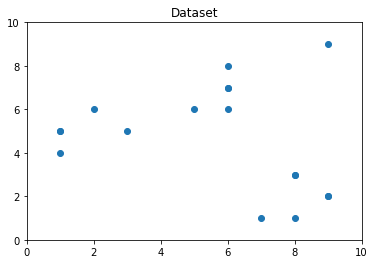
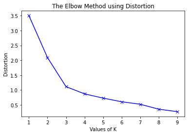
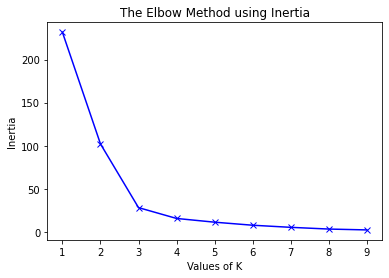
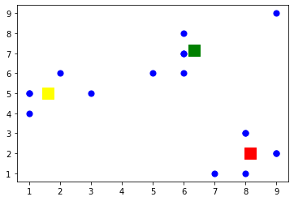

```python
from sklearn.cluster import KMeans
from sklearn import metrics
from scipy.spatial.distance import cdist
import numpy as np
import matplotlib.pyplot as plt
```


```python
x1=np.array([3,1,1,2,1,6,6,6,5,6,7,8,9,9,8,9,8])
x2=np.array([5,4,5,6,5,8,6,7,6,7,1,1,2,9,3,2,3])
```


```python
X=np.array(list(zip(x1,x2))).reshape(len(x1),2)
```


```python
X
```


    array([[3, 5],
           [1, 4],
           [1, 5],
           [2, 6],
           [1, 5],
           [6, 8],
           [6, 6],
           [6, 7],
           [5, 6],
           [6, 7],
           [7, 1],
           [8, 1],
           [9, 2],
           [9, 9],
           [8, 3],
           [9, 2],
           [8, 3]])


```python
plt.plot()
plt.xlim([0,10])
plt.ylim([0,10])
plt.title('Dataset')
plt.scatter(x1,x2)
plt.show()
```





```python
distortions=[]
inertias=[]
mapping1={}
mapping2={}
K=range(1,10)
for k in K:
    kmeanModel=KMeans(n_clusters=k).fit(X)
    kmeanModel.fit(X)
    distortions.append(sum(np.min(cdist(X,kmeanModel.cluster_centers_,'euclidean'),axis=1))/X.shape[0])
    inertias.append(kmeanModel.inertia_)
    mapping1[k] = sum(np.min(cdist(X, kmeanModel.cluster_centers_,
                                   'euclidean'), axis=1)) / X.shape[0]
    mapping2[k] = kmeanModel.inertia_
```


```python
for key, val in mapping1.items():
    print(f'{key} : {val}')
```

    1 : 3.500396506411964
    2 : 2.0916423375737434
    3 : 1.1148158469966682
    4 : 0.8721230541838102
    5 : 0.7299929630101789
    6 : 0.6067178780284417
    7 : 0.5240769031638796
    8 : 0.3576988370023389
    9 : 0.2745098039215686
    


```python
plt.plot(K, distortions, 'bx-')
plt.xlabel('Values of K')
plt.ylabel('Distortion')
plt.title('The Elbow Method using Distortion')
plt.show()
```





```python
for key, val in mapping2.items():
    print(f'{key} : {val}')
```

    1 : 231.64705882352942
    2 : 102.10606060606058
    3 : 28.200000000000003
    4 : 15.633333333333333
    5 : 11.3
    6 : 7.7666666666666675
    7 : 5.333333333333333
    8 : 3.333333333333333
    9 : 2.3333333333333335
    


```python
plt.plot(K, inertias, 'bx-')
plt.xlabel('Values of K')
plt.ylabel('Inertia')
plt.title('The Elbow Method using Inertia')
plt.show()
```





```python
Kmean=KMeans(n_clusters=3)
Kmean.fit(X)
```


    KMeans(n_clusters=3)


```python
KMeans(algorithm='auto',copy_x=True,init='k-means++',max_iter=300,n_clusters=2,n_init=10,n_jobs=1,precompute_distances='auto',random_state='None',tol=0.0001,verbose=0)
```


    KMeans(n_clusters=2, n_jobs=1, precompute_distances='auto', random_state='None')


```python
Kmean.cluster_centers_
```


    array([[6.33333333, 7.16666667],
           [8.16666667, 2.        ],
           [1.6       , 5.        ]])


```python
plt.scatter(X[:,0],X[:,1],s=50,c='b')
plt.scatter(6.33333333, 7.16666667 , s=200,c='g',marker='s')
plt.scatter(8.16666667, 2.,s=200,c='r',marker='s')
plt.scatter(1.6       , 5. ,s=200,c='yellow',marker='s')
plt.show()
```





```python
Kmean.labels_
```


    array([2, 2, 2, 2, 2, 0, 0, 0, 0, 0, 1, 1, 1, 0, 1, 1, 1])


```python
sample_test=np.array([-3.0,-3.0])
second_test=sample_test.reshape(1,-1)
Kmean.predict(second_test)
```


    array([2])


```python
sample_test=np.array([5.0,3.0])
second_test=sample_test.reshape(1,-1)
Kmean.predict(second_test)
```


    array([1])


```python
sample_test=np.array([6.0,7.0])
second_test=sample_test.reshape(1,-1)
Kmean.predict(second_test)
```


    array([0])


```python

```
